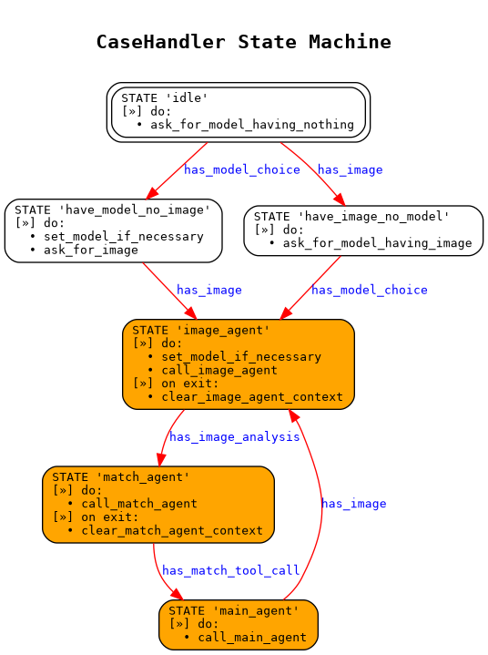

# dji-agras-assistant

WhatsApp technical assistant for DJI Agras `T40` and `T50`, built on top of
[`wa-agents`](https://github.com/luis-i-reyes-castro/wa-agents).

The app is designed as a multi-turn state machine:
- it collects the drone model and/or an image from the user,
- runs an image-analysis agent,
- runs a match agent against the domain-knowledge database,
- runs a main agent with tool calls to produce the final diagnosis or guidance.

## State Machine

The conversation logic lives in [`CaseHandler.get_state_machine_config()`](casehandler.py).
Its core states are:
- `idle`
- `have_model_no_image`
- `have_image_no_model`
- `image_agent`
- `match_agent`
- `main_agent`

The handler itself is initialized as a `transitions.Machine` via
`CaseHandlerBase.init_machine(...)`. Stored messages are replayed into the
handler with `ingest_message(...)`, so the current FSM state can be rebuilt from
persisted case context.



## Domain Knowledge

[`domain_knowledge/dk_database.py`](domain_knowledge/dk_database.py) exposes the
knowledge base used by the agents and tools. It currently supports:
- model selection for `T40` and `T50`,
- message and placeholder catalogs used to narrow likely diagnoses,
- component and joint-diagnosis lookups,
- resolution tracking.

The main tool calls exposed through [`ToolServer`](tool_server.py) are:
- `get_component_data`
- `get_joint_diagnosis`
- `mark_as_resolved`

## Runtime Flow

1. [`run_listener.py`](run_listener.py) receives WhatsApp webhooks and pushes them into a SQLite queue.
2. [`run_queue_worker.py`](run_queue_worker.py) drains that queue and instantiates [`CaseHandler`](casehandler.py).
3. [`CaseHandler`](casehandler.py) rebuilds conversation state from persisted context and advances its FSM.
4. The handler routes work across these stages:
   - ask for missing model or image,
   - `image_agent`: analyze the uploaded image,
   - `match_agent`: narrow candidate diagnostics with domain knowledge,
   - `main_agent`: answer with tool calls and case resolution updates.
5. [`tool_server.py`](tool_server.py) exposes the domain-knowledge tools used by the agents.

## Main Files

| Path | Purpose |
| --- | --- |
| [`casehandler.py`](casehandler.py) | Application-specific state machine and agent orchestration |
| [`tool_server.py`](tool_server.py) | Tool execution layer for component data and diagnosis lookup |
| [`run_listener.py`](run_listener.py) | Webhook HTTP entrypoint |
| [`run_queue_worker.py`](run_queue_worker.py) | Async worker process |
| [`domain_knowledge/`](domain_knowledge/) | Structured knowledge base, preprocessing, analysis, and validation scripts |
| [`agent_prompts/`](agent_prompts/) | Prompt templates and interactive-message payloads |
| [`agent_tools/`](agent_tools/) | Tool schemas used by the match and main agents |
| [`agent_testing/`](agent_testing/) | Lightweight local smoke tests for text, image, and tool flows |

## Setup

Create a Python environment and install dependencies:

```bash
python3 -m venv .venv
source .venv/bin/activate
pip install -r requirements.txt
```

This repo depends on:
- [`sofia-utils`](https://github.com/luis-i-reyes-castro/sofia-utils)
- [`wa-agents`](https://github.com/luis-i-reyes-castro/wa-agents)

## Environment Variables

At minimum, the app needs the same base variables required by `wa-agents`:

| Variable | Description |
| --- | --- |
| `BUCKET_NAME` | DigitalOcean Spaces bucket name |
| `BUCKET_REGION` | Spaces region, for example `atl1` |
| `BUCKET_KEY_ID` | Spaces access key ID |
| `BUCKET_KEY_SECRET` | Spaces secret access key |
| `WA_TOKEN` | WhatsApp Graph API token |
| `WA_VERIFY_TOKEN` | WhatsApp webhook verification token |

Queue settings are optional:

| Variable | Default |
| --- | --- |
| `QUEUE_DB_DIR` | repo directory |
| `QUEUE_DB_NAME` | `queue.sqlite3` |
| `PORT` | `8080` |

If you enable LLM calls, set the provider keys required by the configured agent
models. In practice this usually means `OPENROUTER_API_KEY`; depending on your
setup you may also need `OPENAI_API_KEY` or `MISTRAL_API_KEY`.

## Build / Preprocessing

Before running the app, preprocess the domain knowledge and expand prompt
templates:

```bash
bash app_build.sh
```

That script:
- rebuilds the parsed knowledge bases for `T40` and `T50`,
- validates the generated knowledge data,
- expands prompt templates such as `main.md` and `image.md` into model-specific files.

You can also run the steps manually:

```bash
bash dk_processing.sh T40
bash dk_processing.sh T50
python3 parse_agent_prompts.py
```

## Running

For local development, run the listener and worker in separate terminals:

```bash
python3 run_listener.py
```

```bash
python3 run_queue_worker.py
```

For container-style execution, use:

```bash
bash app_run.sh
```

That starts:
- `supervisord` with [`supervisord.conf`](supervisord.conf) to manage the queue worker,
- `gunicorn` serving `run_listener:app` as the main process.

## Helper Scripts

Smoke-test the domain-knowledge database:

```bash
python3 -m domain_knowledge.dk_database_testing
```

Rank components by risk:

```bash
python3 -m domain_knowledge.dk_analysis rank_comp_risk domain_knowledge/T40_dka T40_comp_risk_analysis.json
python3 -m domain_knowledge.dk_analysis rank_comp_risk domain_knowledge/T50_dka T50_comp_risk_analysis.json
```

Run local agent smoke tests:

```bash
python3 agent_testing/test_text.py
python3 agent_testing/test_images.py path/to/image.jpg
python3 agent_testing/test_tools.py
```
