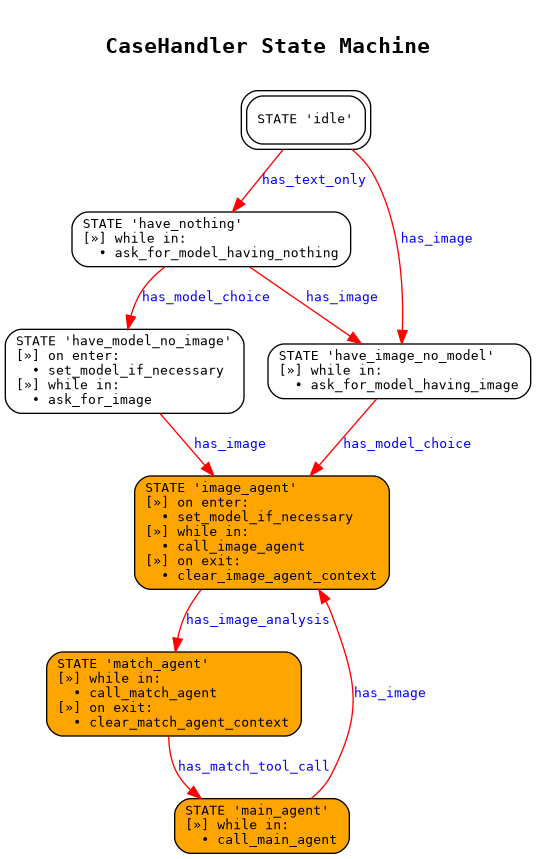

# dji-agras-assistant

WhatsApp technical assistant for DJI Agras `T40` and `T50`, built on top of
[`wa-agents`](https://github.com/luis-i-reyes-castro/wa-agents).

The app is designed as a multi-turn state machine:
- it collects the drone model and/or an image from the user,
- runs an image-analysis agent,
- runs a match agent against the domain-knowledge database,
- runs a main agent with tool calls to produce the final diagnosis or guidance.

## State Machine

The conversation logic lives in
[`CaseHandler.define_state_machine_config()`](casehandler.py).
Its core states are:
- `idle`
- `have_model_no_image`
- `have_image_no_model`
- `image_agent`
- `match_agent`
- `main_agent`

The handler itself is initialized as a `transitions.AsyncMachine` via
`AsyncWhatsAppCaseHandler.init_machine(...)`. The current FSM state and selected
drone model are persisted together in `wa_case_handler_case_manifests.machine_state`:
plain state names are used before model selection, and values such as
`match_agent,T50` are used afterward. Restoring a case does not replay transitions;
stored messages are only scanned to rebuild the derived agent contexts.



## Domain Knowledge

[`domain_knowledge/dk_database.py`](domain_knowledge/dk_database.py) exposes the
knowledge base used by the agents and tools. It currently supports:
- model selection for `T40` and `T50`,
- message and placeholder catalogs used to narrow likely diagnoses,
- component and joint-diagnosis lookups,
- resolution tracking.

The main tool calls exposed through [`ToolServer`](tool_server.py) are:
- `get_component_data`
- `get_joint_diagnosis`
- `mark_as_resolved`

## Runtime Flow

1. Sofia's `WhatsAppAPIServer` receives WhatsApp webhooks, normalizes them in
   Supabase Postgres, resolves a case-handler route, and enqueues the message.
2. The server's lifespan-managed `AsyncQueueWorker` drains messages routed with
   `handler_key = 'da-assistant'` and instantiates [`CaseHandler`](casehandler.py).
3. [`CaseHandler`](casehandler.py) restores its persisted state and advances its FSM.
4. The handler routes work across these stages:
   - ask for missing model or image,
   - `image_agent`: analyze the uploaded image,
   - `match_agent`: narrow candidate diagnostics with domain knowledge,
   - `main_agent`: answer with tool calls and case resolution updates.
5. [`tool_server.py`](tool_server.py) exposes the domain-knowledge tools used by the agents.

## Main Files

| Path | Purpose |
| --- | --- |
| [`casehandler.py`](casehandler.py) | Application-specific state machine and agent orchestration |
| [`tool_server.py`](tool_server.py) | Tool execution layer for component data and diagnosis lookup |
| Sofia `backend/app.py` | Webhook HTTP entrypoint and handler registry |
| `wa_agents.AsyncQueueWorker` | Lifespan-managed queue worker |
| [`domain_knowledge/`](domain_knowledge/) | Structured knowledge base, preprocessing, analysis, and validation scripts |
| [`agent_prompts/`](agent_prompts/) | Prompt templates and interactive-message payloads |
| [`agent_tools/`](agent_tools/) | Tool schemas used by the match and main agents |
| [`agent_testing/`](agent_testing/) | Lightweight local smoke tests for text, image, and tool flows |

## Setup

Initialize the submodule and install Sofia's backend dependencies:

```bash
git submodule update --init --recursive
pip install -r backend/requirements.txt
```

This repo depends on:
- [`sofia-utils`](https://github.com/luis-i-reyes-castro/sofia-utils)
- [`wa-agents`](https://github.com/luis-i-reyes-castro/wa-agents)

## Environment Variables

At minimum, the app needs the same base variables required by `wa-agents`:

| Variable | Description |
| --- | --- |
| `BUCKET_NAME` | DigitalOcean Spaces bucket name |
| `BUCKET_REGION` | Spaces region, for example `atl1` |
| `BUCKET_KEY_ID` | Spaces access key ID |
| `BUCKET_KEY_SECRET` | Spaces secret access key |
| `WA_TOKEN` | WhatsApp Graph API token |
| `WA_VERIFY_TOKEN` | WhatsApp webhook verification token |

If you enable LLM calls, set the provider keys required by the configured agent
models. In practice this usually means `OPENROUTER_API_KEY`; depending on your
setup you may also need `OPENAI_API_KEY` or `MISTRAL_API_KEY`.

## Build / Preprocessing

Before running the app, preprocess the domain knowledge and expand prompt
templates:

```bash
bash build.sh
```

That script:
- rebuilds the parsed knowledge bases for `T40` and `T50`,
- validates the generated knowledge data,
- expands prompt templates such as `main.md` and `image.md` into model-specific files.

You can also run the steps manually:

```bash
bash dk_processing.sh T40
bash dk_processing.sh T50
python3 parse_agent_prompts.py
```

## Running

The handler runs inside `sofia-server`; it has no standalone listener or worker.
From the Sofia repository, initialize the submodule and start the normal stack:

```bash
git submodule update --init --recursive
./deploy_now.sh --local
```

The backend image runs `build.sh` during its build and starts the webhook server and
queue worker in the same FastAPI process.

Configure a business route after applying the current `wa_agents` schema:

```sql
INSERT INTO public.wa_case_handler_routes (
  business,
  contact,
  handler_key
)
VALUES (
  '<WA_API_BUSINESSES_ID>',
  NULL,
  'da-assistant'
)
ON CONFLICT
  ( business, contact)
DO
  UPDATE
SET
  handler_key = EXCLUDED.handler_key,
  updated_at  = now();
```

## Helper Scripts

Smoke-test the domain-knowledge database:

```bash
python3 -m domain_knowledge.dk_database_testing
```

Rank components by risk:

```bash
python3 -m domain_knowledge.dk_analysis rank_comp_risk domain_knowledge/T40_dka T40_comp_risk_analysis.json
python3 -m domain_knowledge.dk_analysis rank_comp_risk domain_knowledge/T50_dka T50_comp_risk_analysis.json
```

Run local agent smoke tests:

```bash
python3 agent_testing/test_text.py
python3 agent_testing/test_images.py path/to/image.jpg
python3 agent_testing/test_tools.py
```
